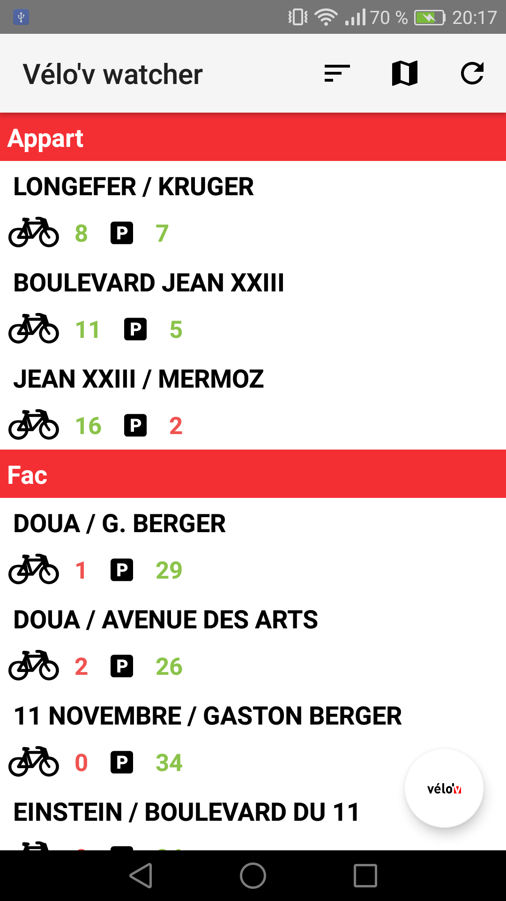
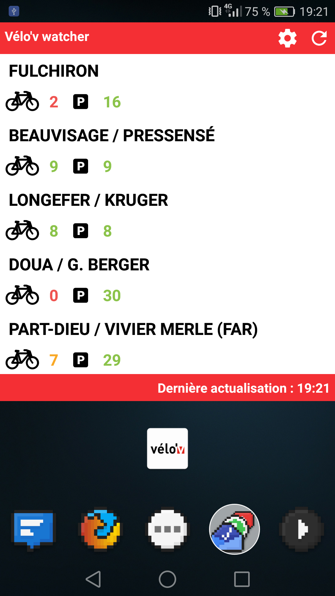
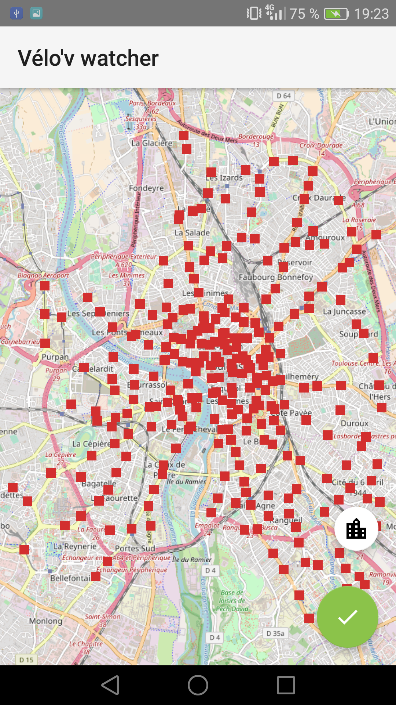
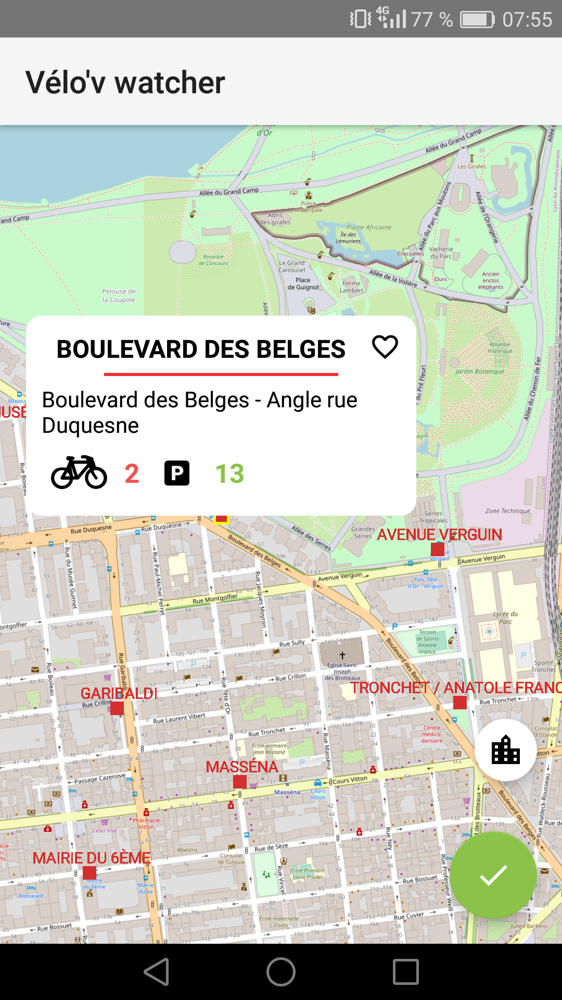
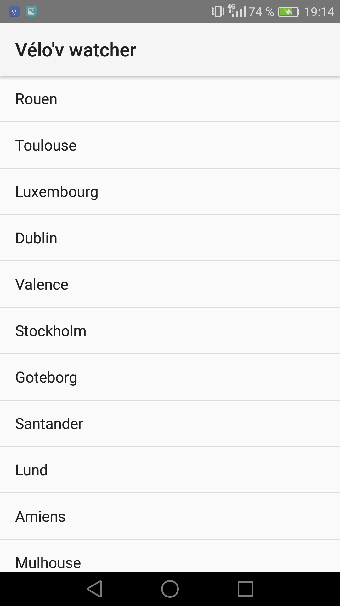

# VelovWatcher
Anddroid app to keep an eye on JCDecaux's Cyclocity stations. Using awesome [osmdroid](https://github.com/osmdroid/osmdroid) as the main map, and the [official JCDecaux's API](https://developer.jcdecaux.com/#/opendata/vls?page=getstarted) to parse real time infos.

Download the app : [here](https://drive.google.com/open?id=1uFlwgq44OO72nKkBZl9_p_wx_n0mNCVH)

    

# Working
* Parsing real time informations of every pinned station about available bikes/bike stands
* Ability to choose from any affiliated city in the world
* Configure pinned stations/change current city at any time
* Sort the stations manually and add separators

# Coming soon
* Homescreen widget to keep an eye without launching the app
